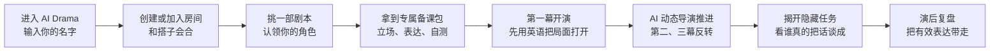

# AI Drama

## 把职场英语口语，变成一场双人剧本杀疯狂之夜

你不是来背一组“商务英语必备句”的。

你是来赴一场即将失控的行业峰会、签下一份有问题的收购协议，或在发布会倒计时归零前，决定到底说真话还是赌一次。

**AI Drama** 是一款双人沉浸式职场英语口语产品。两个人进入同一间线上房间，认领不同角色，在有时间压力、信息差和隐藏任务的正式职业场景里，全程用英语把局面谈下来。

这不是英语课。这是一场越演越疯的职场剧本杀。

> 两个人，一间线上房间，一份只有你看得到的任务卡。今晚谁能把话说到最后？

## 今晚挑什么本？

每一部剧本约 25 分钟。你不会拿到完整台词，只有身份、立场、表达武器和一个不能让对方知道的目标。

| 剧本 | 今晚的局 | 你会练到的英语 |
| --- | --- | --- |
| **《最后一班夜航》** | 行业峰会结束后的暴雨夜，危机公关与调查记者被困在同一间贵宾室。一段录音，决定品牌能否撑到明天。 | 危机沟通、追问事实、争取时间、媒体应对 |
| **《董事会前夜》** | 收购案开会前 20 分钟，协议多出一页没人承认见过的附录。签字、延期，还是把真相带进董事会？ | 高层沟通、风险披露、合规表达、谈判让步 |
| **《消失的发布会 Demo》** | 产品发布会倒计时中，明星 Demo 突然黑屏。创始人和投资人代表必须先决定救项目，还是揭开一个谎言。 | 项目危机、说服、澄清、对投资人表达 |

## 你会怎么经历这一局？

### 01. 进房：别让搭子等太久

创建一个房间，或者输入对方发来的房间码。你们可以在两台电脑、两个地点进入同一局；房间会同步剧本、角色、进度和舞台信息。

### 02. 选角：你知道自己的底牌，对方不知道

每局固定一男一女两位主角，但没有“正确角色”。你要选的是更想练的沟通位置：危机公关还是记者，业务负责人还是首席法务，创始人还是投资人代表。

角色有公开人设，也有只能由你完成的隐藏目标。真正好玩的地方在于：你们的目标彼此牵制，但并不一定只能有一个人赢。

### 03. 备课：不是同一本讲义，是你的作战包

AI Drama 会根据你认领的角色，给你不同的备课路线：

- **共同基础**：这一局两个人都需要的核心表达
- **角色专属表达**：只为你的立场准备的说法
- **升级句**：把“我觉得不行”变成有力量、有余地的职场表达
- **开口自测**：先说，再看参考答案，不让你把英语练成阅读理解

### 04. 开演：没有台词，只有局势

第一幕由你们自由演。舞台会同步双方发言，点亮你用到的关键表达；卡住时可以求助，但故事不会替你说完。

到了幕间，AI 会根据你们真实说过的话继续推进剧情。你们说得越多，后面的局越像属于你们自己的版本。

### 05. 封盘：揭任务、看复盘、带走能用的句子

结束后，双方的任务卡才会公开。你会看到：

- 你的隐藏目标有没有完成
- 哪些表达真的被你用出来了
- AI 对谈判策略、表达清晰度和互动质量的反馈
- 可以带进复习本、下次在真实会议里继续用的句子

## 为什么它能让人真的开口？

因为你不是“被要求练英语”，而是有一件必须靠英语解决的事。

你要争取十二小时、拿到签字、保住一场发布会、让对方说出一个不能说的事实。词汇和句型不再是题目，而是你手里的筹码。

**戏剧张力负责让人想继续演，正式职业场景负责让每一次开口都值得带回现实。**

## 适合谁来玩？

- 想提升工作场景、跨团队协作、客户会英语的人
- 想练正式社交、行业峰会、商务晚宴、投资人沟通的人
- 背过很多句子，却在真实对话里很难持续说下去的人
- 有一个愿意一起“入局”的搭子，想把英语练习变成固定的快乐约局的人

## 现在开一局

打开 [AI Drama](https://duo-stage-vercel.vercel.app)，把链接和房间码发给你的搭子。选本、选角、开演。

建议第一次从 **《董事会前夜》** 或 **《消失的发布会 Demo》** 开始：场景够正式，冲突够强，最容易感受到“原来工作英语可以这样练”。

## 使用边界

这是一个早期双人私用版本。请只把房间码分享给受信任的同伴；不要把真实公司机密、客户信息、未公开项目或个人敏感信息写进自定义剧本。

---

**AI Drama**：让每一次开口，都像你真的坐在那张关键会议桌前。
